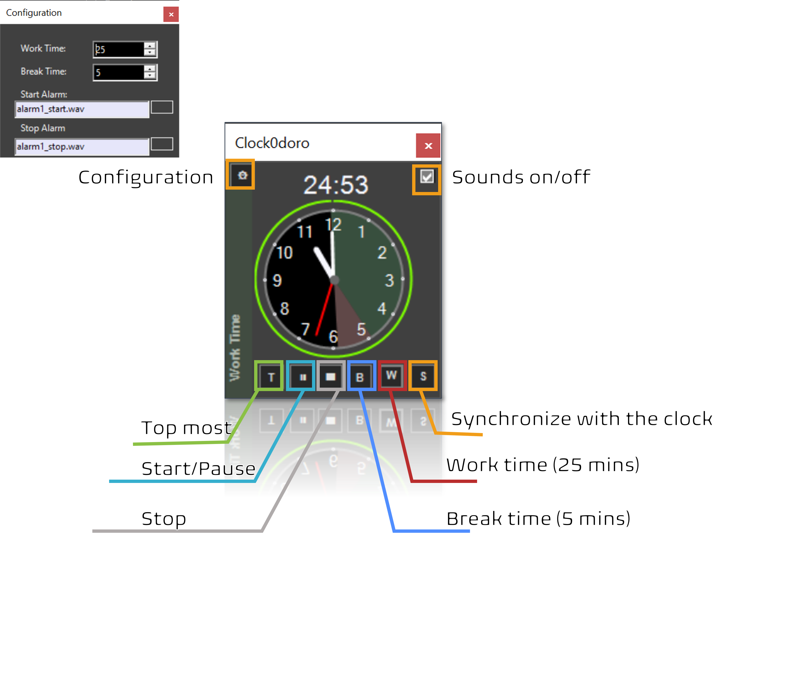

# clock0doro
 Pomodoro Timer

Clock0doro is a simplistic yet efficient, all-you-need for a simple yet-performant time management tool that uses [Pomodoro Technique| https://en.wikipedia.org/wiki/Pomodoro_Technique ] (25 minutes/5 minutes). What I wanted/needed is the following:
- Always on top, that's togglable
- A timer that automatically go to work, then break, then work
- No popup message, just an audio+visual indicator (a loud bell is appreciated, but togglable)
- Pause at any time
- Force break or work time
- Synchronize with the clock (i.e., start work at minute 0 or 30)
- Possibly an analog clock with a progress bar and visual indicator on how much time is remaining

# Getting Started

# History
After being disappointed in many Pomodoro Timers, I have decided to make my own. 
I have been using this Pomodoro timer for my work as a Ph.D. student since February 2023. I have been enjoying it very much.
I have distributed it to my friends and colleagues.
Then, maybe I thought somebody else would enjoy it. I decided to upload it under MIT license
Currently I'm pretty happy about every part of it.

# Name Origin
Clock0doro is spelled Clock o d'oro (a portmanteau of **Clock** and Pomo**doro**). Therefore, you can either say it's a golden clock or a clock & Pomodoro; it's up to you.

# Break Bell sound is so annoying
Thank you, it's a compliment; it's so annoying that it makes you stop working and take a break. This is how I designed it
You can change it, it's ala1.wav
I have included some sounds in [other_sounds/]

# License
Licensed under MIT License